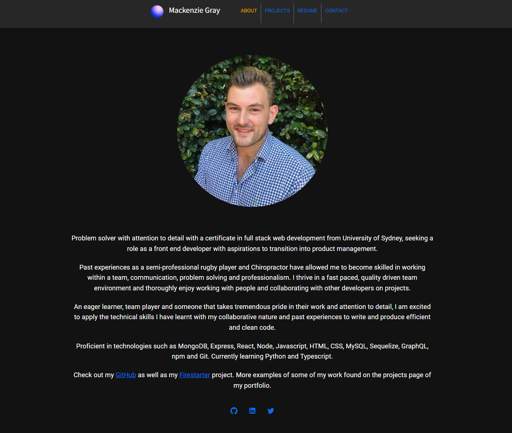
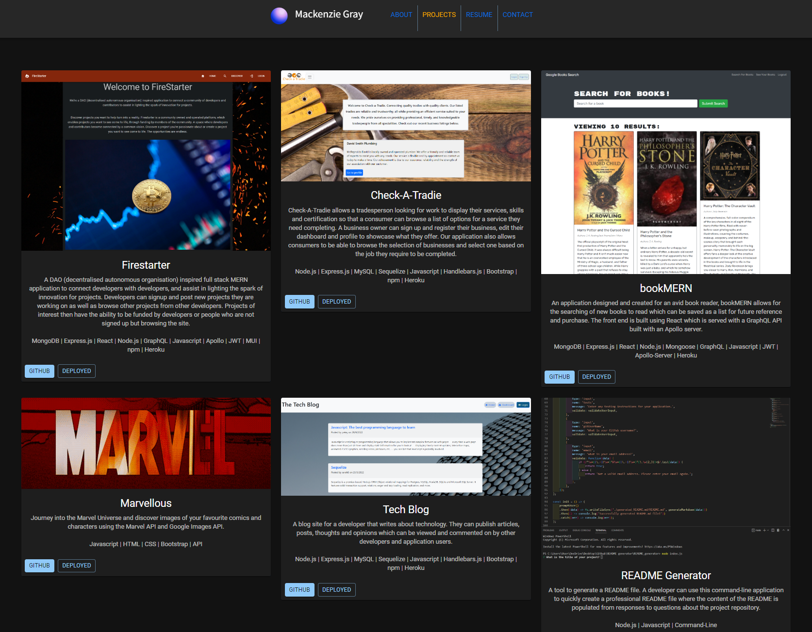
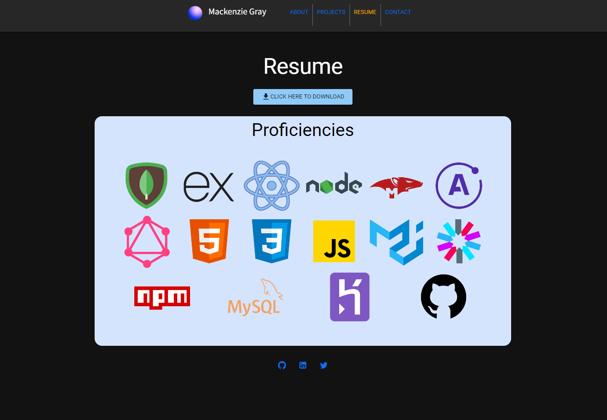
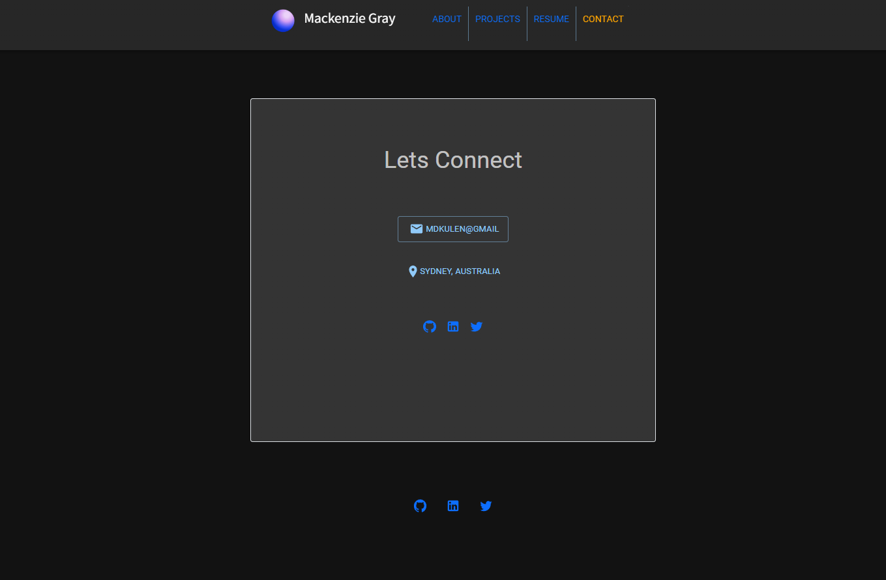

# Portfoligray

[](https://opensource.org/licenses/MIT)

## Description

A portfolio to showcase my skills and some of my previous projects in web development. This application was made with React and MUI as the React UI. 

## User Story

```
AS AN employer looking for candidates with experience building single-page applications
I WANT to view a potential employee's deployed React portfolio of work samples
SO THAT I can assess whether they're a good candidate for an open position
```

## Link to deployed application

[Click here to view portfolio](https://mdkgray.github.io/portfoligray/)

## Table of Contents

* [Usage](#Usage)
* [Screenshots](#Screenshots)
* [License](#License)
* [Acknowledgments](#Acknowledgments)
* [Questions](#Questions)

## Usage

Wander your way through the application and contact with any questions. 

## Screenshots






## License

MIT

#### For more information on the license, click the badge icon in the title section.

## Acknowledgments

University of Sydney Coding Bootcamp

## Questions

### For further information contact using the following:

#### GitHub: [mdkgray](https://github.com/mdkgray)

#### Email: mdkulen@gmail.com

_This README was generated using [README Generator](https://github.com/mdkgray/README_generator)_
